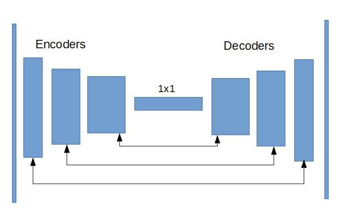

# Deep learning project

## Neural network architecture

The neural network used to solve this project is a FCN. It allows to filter images to extract characteristics and compose an output image with the identified elements and positions. The neural network is composed by several encoding layers (composed by convolutional layers), followed by a 1x1 convolution and several decoding layers (composed by transposed convolutions and skip connections).

 * I use 3 encoding layers increasing the number of filters (32, 64, 128). They are composed by a separable 2d convolution layer with ReLU activation function and a batch normalization. These layers get different characteristics from the image.
 * In the middle I use a 1x1 convolution with 512 filters. It is an inexpensive way of making the model deeper and have more parameters.
 * The last part of the network is composed by 3 decoder layers. They are composed by a biliniar upsample of the input, a concatenation with the skip connection layer and 2 separable 2d convolutional layers. These layers compose a new image where identified characteristics are shown.
 
 I have tested the network with different number of layers but this configuration gave the best results.
 
## Training parameters
 
 The parameters used for training are:
 * Epochs: I have tried from 10 to 100 with different results. My best training was with 30.
 * Learning rate: I have tested different values from 0.1 to 0.001. My selected value is 0.003.
 * Bach size: I have the greater value my hardware can support (42).
 * Steps per epoch: The necessary number of steps to train all my images (122).
 * Workers: I have used 2 becuse my hardware does not work better with more.
 
 
## Other considerarions

The network can identify other objects but it requires a different training set that shows the network which object to look for.

To improve the obtained results, it will be necessary to get more examples of images to get a more precise learning. It will be important to get more images of the hero been far and without the hero.

The final result obtained in the given notebook is 0.486.
